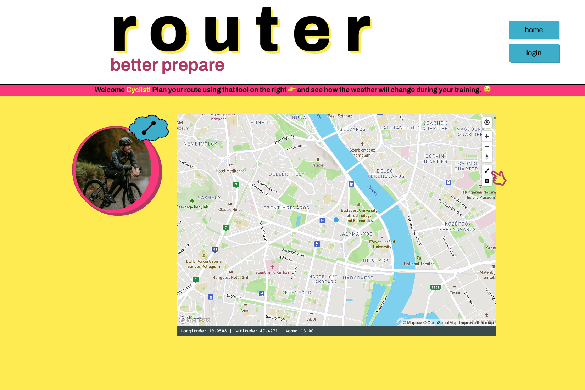

# Router - Better prepare

## Codecool Full-Stack API final exam project

A developmental MERN-stack web app, created heavily with React, and Express.

The app is live at: <a href="https://thunderous-concha-3ba15b.netlify.app/">Router - Better prepare</a>

## _Notes on how to use the map in v1.0.0_ 💬

- You can zoom in-out or click&drag the map at any time

1. Click the "line-string" tool on the right hand side of the map
2. Click anywhere on the map to set your route's **starting point**

- Optional: click additional checkpoints along your route

3. Click anywhere on the map to set your route's **ending point**
4. Click again on the same spot or hit **Enter** to finish

- Now you'll see the recommended route and the weather info along
- Feel free to zoom or move the map

5. ❗️ _Before you start drawing a new route, ALWAYS click the_ 🗑 _"trash-tool" first_

- [Screenshots](#screenshots)
- [User story](#user-story)
- [Theme of the project](#theme-of-the-project)
- [Features of version 1.0.0](#features-of-version-1.0.0)
- [Planned features of version 2.0.0](#planned-features-of-version-2.0.0)
- [Setup requirements](#setup-requirements)
- [How to start](#how-to-start)
- [Deploy](#deploy)
- [Main technologies and services](#main-technologies-and-services)
- [API documentation at Swagger](#api-documentation-at-swagger)
- [APIs used](#apis-used)

## User story

```
"As a cyclist, I want to see how the weather will change on my ride, so I can better prepare."
```

## Theme of the project

The base idea of this project is coming from personal experience. Every time I'm planning to go out for a bicycle training session (or back when I was doing food delivery) I curiously scan the sky, analyze weather forecasts and try to figure out how to best prepare. Especially if conditions look uncertain. Nobody wants to get caught in the rain, heavy wind, or choking humidity and has nothing in their pockets to ease the situation. It would be very useful to precisely foresee all the possible weather changes on your exact route planned for the day.

## Features of version 1.0.0

- geolocate the user on site load
- draw your route in an integrated Mapbox map (using points)
- the app gives you a recommended route (without navigation)
- OpenWeather provides 4 or 5 forecast points along your route
  - at the exact time the map estimates you to be there
  - including: sky conditions, temperature (metric), wind speed, humidity, expected volume of rain
- users can login using their Google account
  - and register with a username
- logged in users can save this route (with all relevant data) into their private profile page
  - saved routes can be made public (for "Feed" in v2.0.0)

## Planned features of version 2.0.0

- browse public routes (shared by users)
- filter public routes
- display a "T-Factor" based on how difficult were the weather conditions on your ride
- display wind direction
- unique route names

## Setup requirements

- Terminal
- Visual Studio Code
- Web browser
- Node.js
- Mongo DB

## How to start (if you want to try it out _locally_)

1. Clone the repository and open with Visual Studio Code

2. Using the terminal:

```
cd backend
npm install
cd ../frontend
npm install
cd ..
```

3. Create an .env file at the backend root

- fill out with your own data

```
PORT={your preferred back-end port}
APP_URL={your front-end localhost}
CONNECTION_STRING={a local MongoDB database}

SECRET_KEY={super mega heavy secret}

LOGFLARE_SOURCE_ID={please register}
LOGFLARE_API_KEY={please register}

GOOGLE_CLIENT_ID={please register}
GOOGLE_CLIENT_SECRET={please register}
GOOGLE_REDIRECT_URI={your front-end localhost}/callback/google
```

4. Create an .env file at the frontend root

- fill out with your own data

```
REACT_APP_MAPBOX_ACCESS_TOKEN={please register}
REACT_APP_ROUTER_PROJECT_API={your front-end localhost}/api
REACT_APP_GOOGLE_BASE_URL=https://accounts.google.com/o/oauth2/v2/auth
REACT_APP_GOOGLE_CLIENT_ID={please register}
REACT_APP_OPENWEATHER_API_KEY={please register}
```

5. Start the localhosts

```
cd backend
npm run dev
(<!-- using nodemon in development -->)
cd ../frontend
npm start
```

## Deploy

- Front-end: on Netlify via GitHub
- Back-end: on Heroku via GitHub
- Database: Mongo Cloud (Atlas)

## Main technologies and services

### Front-end

JS, React \
CSS, HTML \
Mapbox GL JS Api \
OpenWeather One Call Api 3.0

### Back-end

Node.js, Express \
MongoDB, Mongoose \
Mongo Atlas \
Jest \
JWT \
Swagger

## API documentation at Swagger

https://app.swaggerhub.com/apis/klikknpro1/router-project-api/1.0.0

## APIs used

Mapbox: https://www.mapbox.com/mapbox-gljs

OpenWeather One Call API 3.0: https://openweathermap.org/api/one-call-3

Photo at Home by <a href="https://unsplash.com/@zoltantasi?utm_source=unsplash&utm_medium=referral&utm_content=creditCopyText">Zoltan Tasi</a> on <a href="https://unsplash.com/s/photos/cyclist?utm_source=unsplash&utm_medium=referral&utm_content=creditCopyText">Unsplash</a>

Photo at Register by <a href="https://unsplash.com/@drew_beamer?utm_source=unsplash&utm_medium=referral&utm_content=creditCopyText">Drew Beamer</a> on <a href="https://unsplash.com/s/photos/welcome?utm_source=unsplash&utm_medium=referral&utm_content=creditCopyText">Unsplash</a>

## Screenshots




